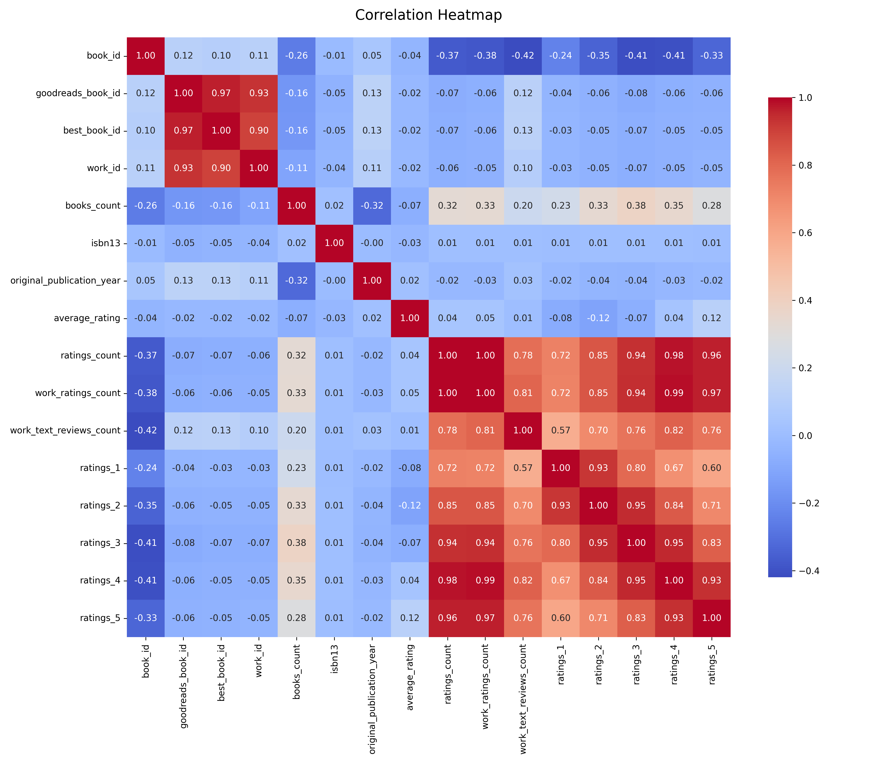
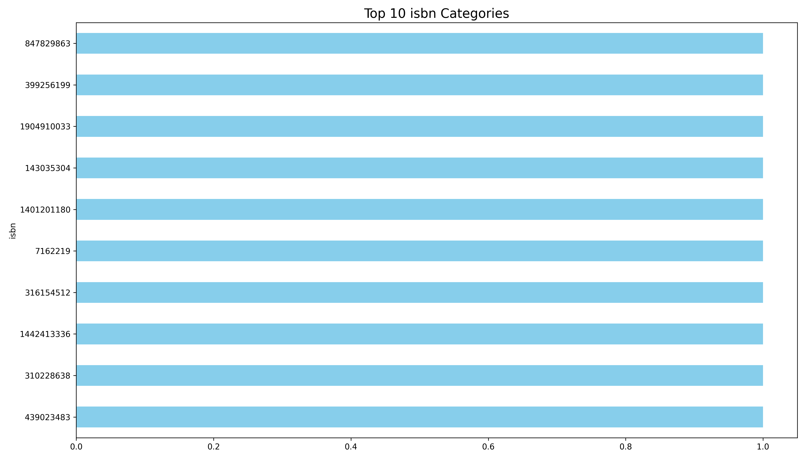
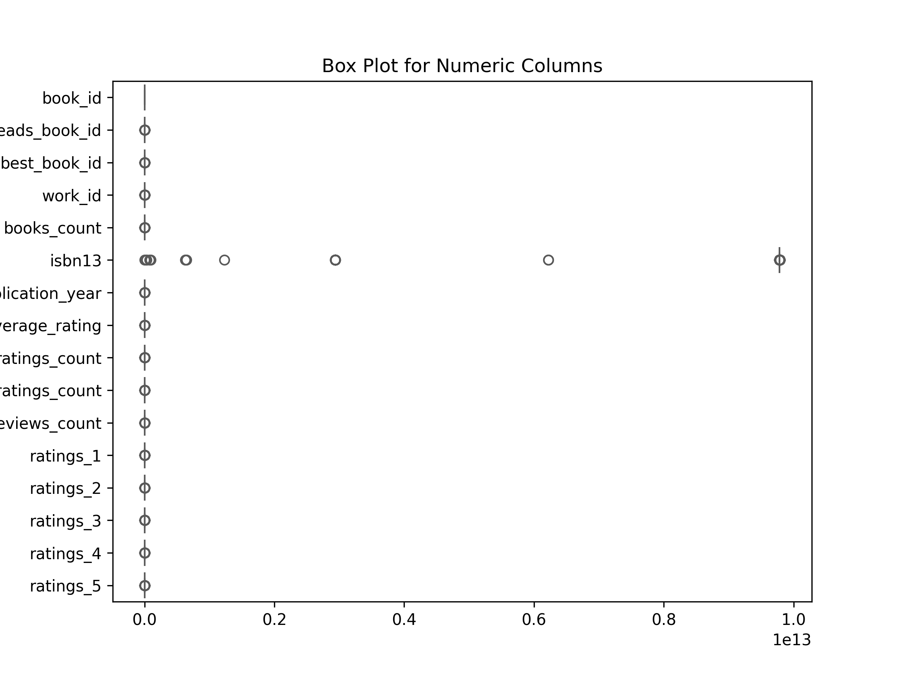

# Analysis Report

### Summary of the Goodreads Dataset

The dataset consists of 10,000 entries about books, featuring 23 columns of information, including identifiers, author details, publication years, ratings, and images. The dataset is comprehensive, although it has missing values in several key columns, such as ISBN, ISBN13, original publication year, original title, and language code.

### Key Insights

1. **Missing Values**: 
   - The dataset contains significant missing values, particularly in the `isbn` (700 missing), `isbn13` (585 missing), `original_publication_year` (21 missing), and `original_title` (585 missing). The `language_code` column also has 1,084 missing entries, which may affect analysis related to language distribution and trends.

2. **Authors**:
   - The dataset features 4,664 unique authors, with Stephen King being the most frequently cited author (60 occurrences). This indicates a strong presence of certain authors in the dataset, which may skew any analysis of popularity or ratings.

3. **Publication Years**:
   - The average original publication year is around 1982, with a range from as early as 1750 to as recent as 2017. This suggests a broad temporal span of the books included, which could provide insights into changes in literary styles and themes over time.

4. **Ratings and Reviews**:
   - The average rating for the books is approximately 4.00, with a standard deviation of 0.25, indicating a generally favorable reception. However, there are significant variances in the number of ratings and reviews, with `ratings_count` averaging 54,001 and `work_text_reviews_count` averaging about 2,920. Some books have very high counts (e.g., ratings_count max 4,780,653), indicating a potential outlier effect.

5. **Language Distribution**:
   - The `language_code` column shows that English (eng) is the predominant language, accounting for 6,341 entries. The high number of missing values (1,084) could limit insights into the diversity of languages represented.

### Recommendations

1. **Data Cleaning**:
   - Address missing values by either imputing them with appropriate techniques or removing those records if they are not critical for the analysis. Focusing on critical columns like `isbn`, `original_publication_year`, and `language_code` is essential for ensuring data integrity.

2. **Author Analysis**:
   - Conduct further analysis on the influence of popular authors like Stephen King. This could involve comparing their works against lesser-known authors to assess trends in ratings and reviews.

3. **Temporal Trends**:
   - Analyze how ratings and reviews have changed over time, particularly in relation to the original publication year. This could help identify shifts in reader preferences and the impact of contemporary literary movements.

4. **Language Insights**:
   - Investigate the impact of language on ratings and reviews to understand the diversity of books in different languages. This analysis could extend to include non-English works to explore global literary trends.

5. **Visualizations**:
   - Employ visualizations such as histograms for rating distributions, scatter plots for ratings vs. reviews, and time series for publication trends. This will help in conveying insights more effectively and will aid in identifying patterns that may not be immediately apparent in raw data.

By following these recommendations, one can derive more meaningful insights from the dataset and better understand the landscape of books represented in Goodreads.

## Sample Data

|   book_id |   goodreads_book_id |   best_book_id |   work_id |   books_count |      isbn |      isbn13 | authors                     |   original_publication_year | original_title                           | title                                                    | language_code   |   average_rating |   ratings_count |   work_ratings_count |   work_text_reviews_count |   ratings_1 |   ratings_2 |   ratings_3 |   ratings_4 |   ratings_5 | image_url                                                  | small_image_url                                            |
|----------:|--------------------:|---------------:|----------:|--------------:|----------:|------------:|:----------------------------|----------------------------:|:-----------------------------------------|:---------------------------------------------------------|:----------------|-----------------:|----------------:|---------------------:|--------------------------:|------------:|------------:|------------:|------------:|------------:|:-----------------------------------------------------------|:-----------------------------------------------------------|
|         1 |             2767052 |        2767052 |   2792775 |           272 | 439023483 | 9.78044e+12 | Suzanne Collins             |                        2008 | The Hunger Games                         | The Hunger Games (The Hunger Games, #1)                  | eng             |             4.34 |         4780653 |              4942365 |                    155254 |       66715 |      127936 |      560092 |     1481305 |     2706317 | https://images.gr-assets.com/books/1447303603m/2767052.jpg | https://images.gr-assets.com/books/1447303603s/2767052.jpg |
|         2 |                   3 |              3 |   4640799 |           491 | 439554934 | 9.78044e+12 | J.K. Rowling, Mary GrandPré |                        1997 | Harry Potter and the Philosopher's Stone | Harry Potter and the Sorcerer's Stone (Harry Potter, #1) | eng             |             4.44 |         4602479 |              4800065 |                     75867 |       75504 |      101676 |      455024 |     1156318 |     3011543 | https://images.gr-assets.com/books/1474154022m/3.jpg       | https://images.gr-assets.com/books/1474154022s/3.jpg       |
|         3 |               41865 |          41865 |   3212258 |           226 | 316015849 | 9.78032e+12 | Stephenie Meyer             |                        2005 | Twilight                                 | Twilight (Twilight, #1)                                  | en-US           |             3.57 |         3866839 |              3916824 |                     95009 |      456191 |      436802 |      793319 |      875073 |     1355439 | https://images.gr-assets.com/books/1361039443m/41865.jpg   | https://images.gr-assets.com/books/1361039443s/41865.jpg   |
|         4 |                2657 |           2657 |   3275794 |           487 |  61120081 | 9.78006e+12 | Harper Lee                  |                        1960 | To Kill a Mockingbird                    | To Kill a Mockingbird                                    | eng             |             4.25 |         3198671 |              3340896 |                     72586 |       60427 |      117415 |      446835 |     1001952 |     1714267 | https://images.gr-assets.com/books/1361975680m/2657.jpg    | https://images.gr-assets.com/books/1361975680s/2657.jpg    |
|         5 |                4671 |           4671 |    245494 |          1356 | 743273567 | 9.78074e+12 | F. Scott Fitzgerald         |                        1925 | The Great Gatsby                         | The Great Gatsby                                         | eng             |             3.89 |         2683664 |              2773745 |                     51992 |       86236 |      197621 |      606158 |      936012 |      947718 | https://images.gr-assets.com/books/1490528560m/4671.jpg    | https://images.gr-assets.com/books/1490528560s/4671.jpg    |
