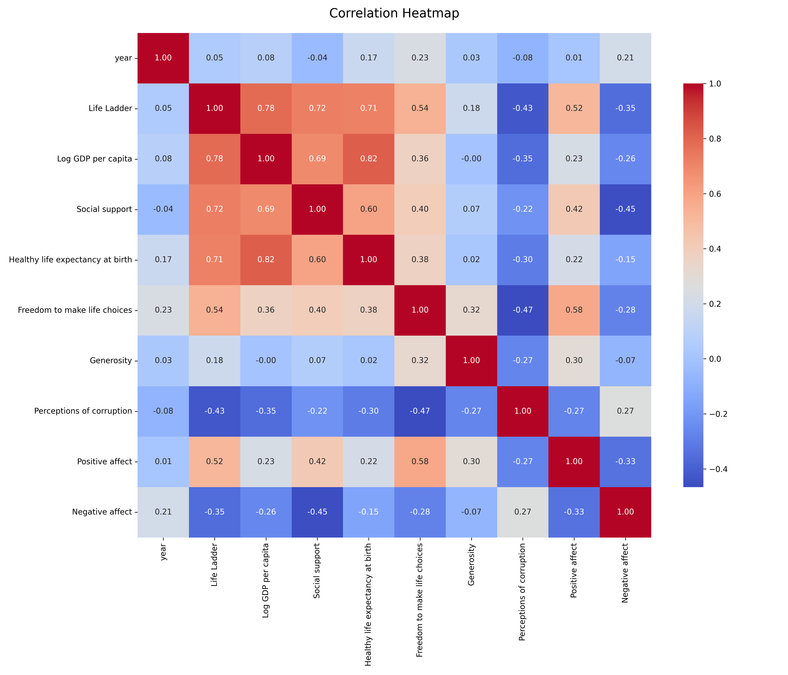
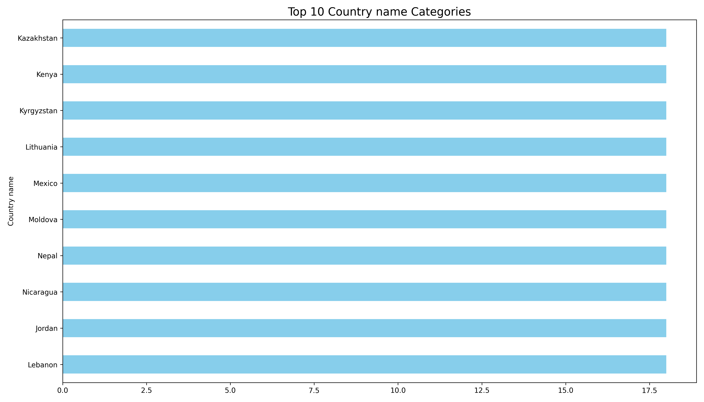
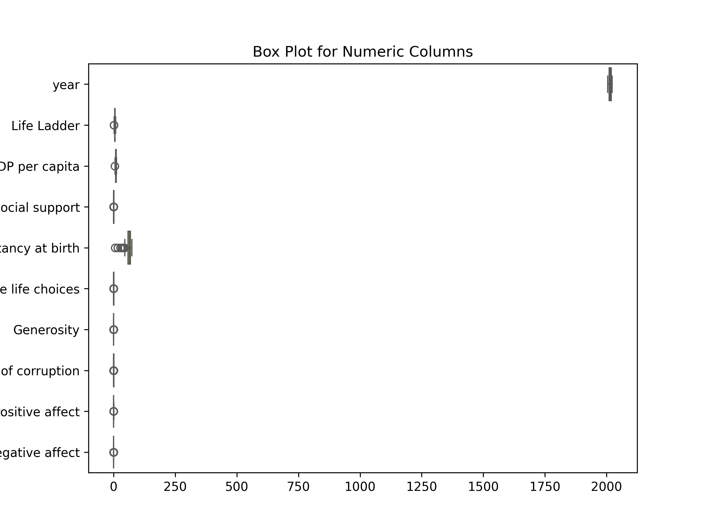

# Analysis Report

### Summary of the Dataset

The dataset `happiness.csv` contains information on happiness indicators across 2363 records for various countries over multiple years. It includes 11 columns, focusing on metrics such as the "Life Ladder" (a measure of subjective well-being), "Log GDP per capita," "Social support," and several others that contribute to the understanding of happiness levels globally.

#### Key Insights

1. **Missing Values**: 
   - Significant missing values are noted in several key metrics:
     - **Generosity** has the highest missing data (81 entries).
     - **Perceptions of corruption** also has a high number of missing entries (125).
     - Other variables, like **Healthy life expectancy at birth** (63) and **Freedom to make life choices** (36), also require attention.
   - Addressing these missing values through imputation or removal of affected rows may be necessary for accurate analysis.

2. **Statistical Overview**:
   - The average "Life Ladder" score is approximately **5.48**, indicating a moderate level of happiness across the countries surveyed.
   - The average **Log GDP per capita** is **9.40**, which suggests a diverse economic landscape among the countries.
   - **Social support** averages at **0.81**, indicating that most individuals feel a sense of community and support.
   - **Generosity** appears very low on average, with a mean close to zero (9.77e-05), highlighting potential cultural or economic factors influencing charitable behavior.
   - **Perceptions of corruption** have an average around **0.74**, suggesting that many countries experience significant issues with corruption.

3. **Disparities in Variables**:
   - The range of values for metrics such as **Healthy life expectancy** (from **6.72** to **74.6**) indicates substantial disparities in health outcomes among different countries.
   - The **Freedom to make life choices** variable also shows variability, with values ranging from **0.228** to **0.985**, suggesting differing levels of personal freedom and autonomy.

#### Recommendations

1. **Data Cleaning**:
   - Address the missing values through appropriate methods (e.g., imputation, use of median values, or exclusion) to ensure the robustness of future analyses.
   
2. **Further Analysis**:
   - Conduct correlation analyses between happiness indicators and economic variables (e.g., GDP per capita) to understand the relationships better.
   - Explore regional differences in happiness metrics to identify trends and areas needing improvement.

3. **Policy Implications**:
   - Countries should focus on improving social support systems and enhancing perceptions of corruption to elevate happiness levels.
   - Investigate the factors contributing to low generosity scores, as fostering a culture of giving could positively influence overall well-being.

4. **Longitudinal Studies**:
   - Given the dataset spans from **2005 to 2023**, consider conducting longitudinal studies to assess how happiness indicators change over time and in response to specific interventions or global events.

By focusing on these insights and recommendations, stakeholders can better understand the multifaceted nature of happiness and develop strategies to enhance well-being across nations.

## Sample Data

| Country name   |   year |   Life Ladder |   Log GDP per capita |   Social support |   Healthy life expectancy at birth |   Freedom to make life choices |   Generosity |   Perceptions of corruption |   Positive affect |   Negative affect |
|:---------------|-------:|--------------:|---------------------:|-----------------:|-----------------------------------:|-------------------------------:|-------------:|----------------------------:|------------------:|------------------:|
| Afghanistan    |   2008 |         3.724 |                7.35  |            0.451 |                               50.5 |                          0.718 |        0.164 |                       0.882 |             0.414 |             0.258 |
| Afghanistan    |   2009 |         4.402 |                7.509 |            0.552 |                               50.8 |                          0.679 |        0.187 |                       0.85  |             0.481 |             0.237 |
| Afghanistan    |   2010 |         4.758 |                7.614 |            0.539 |                               51.1 |                          0.6   |        0.118 |                       0.707 |             0.517 |             0.275 |
| Afghanistan    |   2011 |         3.832 |                7.581 |            0.521 |                               51.4 |                          0.496 |        0.16  |                       0.731 |             0.48  |             0.267 |
| Afghanistan    |   2012 |         3.783 |                7.661 |            0.521 |                               51.7 |                          0.531 |        0.234 |                       0.776 |             0.614 |             0.268 |
