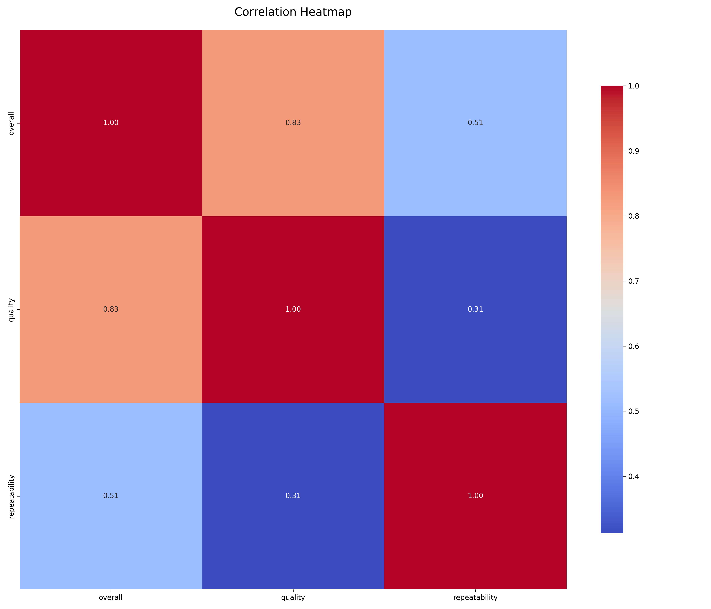
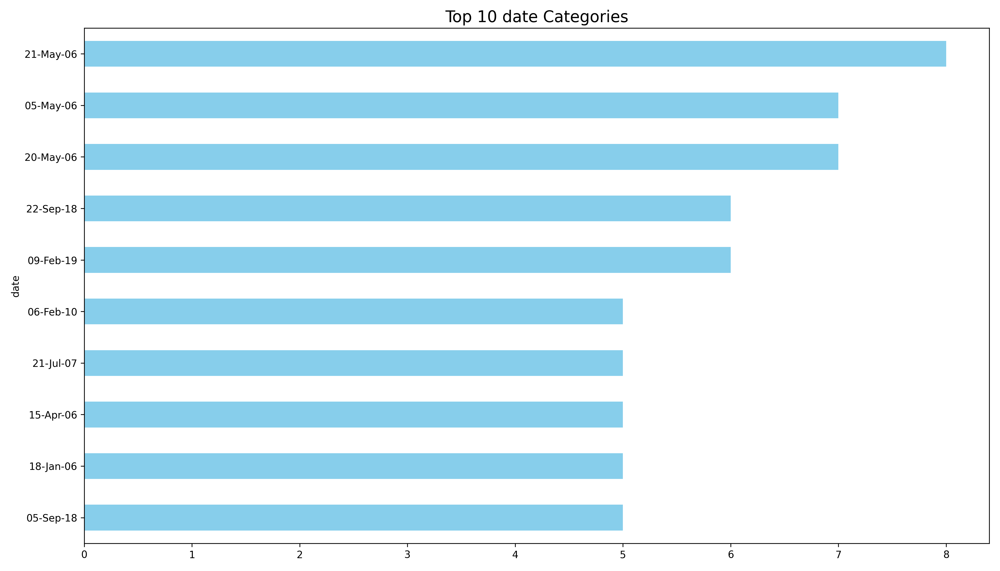
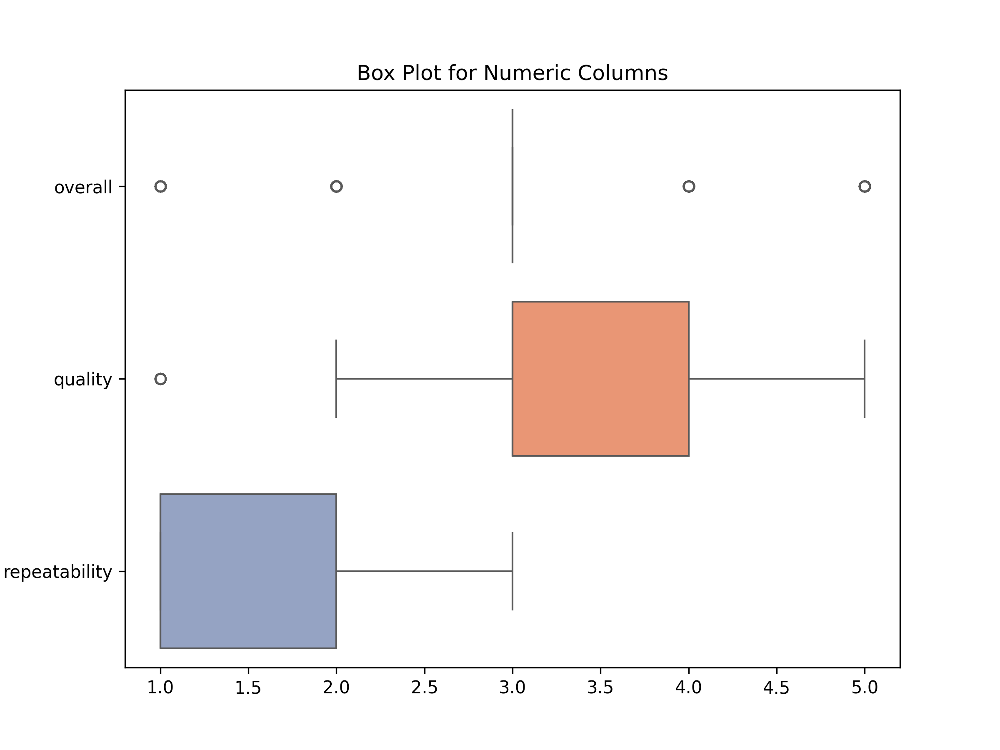

# Analysis Report

### Summary of the Dataset

The dataset `media.csv` contains a total of 2,652 entries, structured across 8 columns: `date`, `language`, `type`, `title`, `by`, `overall`, `quality`, and `repeatability`. The dataset explores various media attributes, including their ratings and characteristics.

#### Key Insights

1. **Date Analysis**:
   - The `date` column has 99 missing values, indicating that 3.73% of the records lack a date entry. The most frequent date recorded is '21-May-06'.

2. **Language Distribution**:
   - The dataset includes 11 unique languages, with English being the most common language (1,306 instances).

3. **Media Type**:
   - There are 8 unique media types, with 'movie' being overwhelmingly dominant (2,211 instances), suggesting a potential focus on films over other media forms.

4. **Title Variability**:
   - With 2,312 unique titles, there is a rich variety of media content. The title 'Kanda Naal Mudhal' appears the most frequently (9 times).

5. **Authorship**:
   - The `by` column has a significant number of missing values (262), but there are 1,528 unique authors. The most frequently credited author is Kiefer Sutherland, with 48 entries.

6. **Rating Insights**:
   - The overall ratings (mean = 3.05) suggest a generally positive reception of the media, with a standard deviation indicating moderate variability in ratings.
   - Quality ratings (mean = 3.21) are similarly positive, indicating that the audience perceives the quality of media favorably.
   - Repeatability ratings (mean = 1.49) indicate that many entries are not likely to be rewatched, suggesting a potential area for improvement in content engagement.

7. **Summary Statistics**:
   - Overall ratings range from 1 to 5, with the majority of ratings clustering around 3.
   - Quality ratings also range from 1 to 5, with a median of 3, indicating consistent quality perception.
   - Repeatability ratings show a significant number of entries rated as 1, suggesting that many media may not encourage repeat viewings.

### Recommendations

1. **Address Missing Values**:
   - Investigate the missing values in the `date` and `by` columns. Completing these records can enrich the dataset and improve analysis.

2. **Explore Language Preferences**:
   - Conduct further analysis on media performance by language. Given the dominance of English, examining other languages may uncover niche markets.

3. **Enhance Media Variety**:
   - Given the overwhelming presence of movies, consider diversifying the dataset by including more entries from underrepresented types to cater to a broader audience.

4. **Improve Repeatability**:
   - Investigate factors contributing to low repeatability ratings. Engaging storytelling or interactive media elements could enhance viewer retention.

5. **Data Visualization**:
   - Utilize charts such as bar graphs for title frequency, pie charts for language distribution, and box plots for ratings to visualize the data insights effectively. Visual representations can help stakeholders quickly grasp trends and areas needing attention.

By implementing these recommendations, the dataset can be better leveraged for insights into audience preferences and media performance, ultimately guiding content creation and marketing strategies.

## Sample Data

| date      | language   | type   | title       | by                            |   overall |   quality |   repeatability |
|:----------|:-----------|:-------|:------------|:------------------------------|----------:|----------:|----------------:|
| 15-Nov-24 | Tamil      | movie  | Meiyazhagan | Arvind Swamy, Karthi          |         4 |         5 |               1 |
| 10-Nov-24 | Tamil      | movie  | Vettaiyan   | Rajnikanth, Fahad Fazil       |         2 |         2 |               1 |
| 09-Nov-24 | Tamil      | movie  | Amaran      | Siva Karthikeyan, Sai Pallavi |         4 |         4 |               1 |
| 11-Oct-24 | Telugu     | movie  | Kushi       | Vijay Devarakonda, Samantha   |         3 |         3 |               1 |
| 05-Oct-24 | Tamil      | movie  | GOAT        | Vijay                         |         3 |         3 |               1 |
